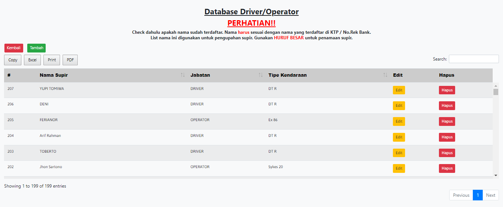
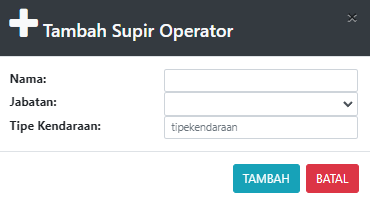

# Driver/Operator

### DATABASE DRIVER/OPERATOR

Tabel ini menginformasikan list supir dan operator yang terdaftar. List ini digunakan untuk pengupahan supir/operator.

Tabel ini bisa menambah, mengedit dan menghapus data supir&#x20;

### Tambah Supir

Form ini untuk menambah kan sopir baru. Check dahulu apakah nama sudah terdaftar. Nama harus sesuai dengan nama yang terdaftar di KTP / No.Rek Bank. List nama ini digunakan untuk pengupahan sopir. Gunakan **HURUF BESAR** untuk memasukan nama supir atau operator

* Nama : Masukan Nama sopir atau operator (harus huruf besar)&#x20;
* Jabatan : Jabatan orang baru (Sopir dan Operator)&#x20;
* Tipe Kendaraan : Tipe kendaraan yang digunakan sopir

### Edit/Rubah Database

Form ini digunakan ketik data sopir atau operator mengalami kesalahan.&#x20;

* Nama : Masukan Nama sopir atau operator (Harus huruf besar)&#x20;
* Jabatan : Jabatan orang baru (Sopir dan Operator)&#x20;
* Tipe Kendaraan : Tipe kendaraan yang digunakan sopir
