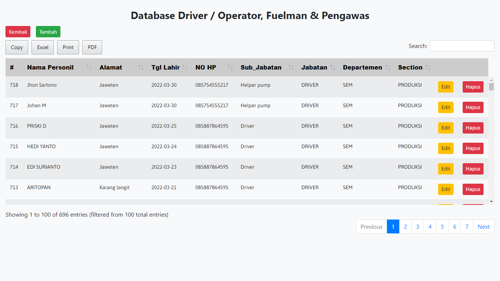
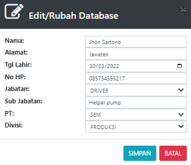

# Foreman dan Fuelman

### DATABASE DRIVER / OPERATOR, FUELMAN & PENGAWAS

Tabel ini menginformasikan list sopir, operator, fuelman, dan pengawas yang terdaftar. List ini digunakan unutk pengupahan sopir/operator.

Tabel ini bisa menambah, mengedit dan menghapus data sopir&#x20;

### TAMBAH SUPIR FOREMAN

Form ini digunkana untuk menambahkan supir  dan foreman untuk kendaraan rimau

* Nama : Masukan nama supir tersebut&#x20;
* Alamat : Alamat rumah supir
* tgl lahir : tanggal lahir supir&#x20;
* No HP : Nomer handphone supir
* Jabatan : Jabatan yang diberikan pada user baru (DRIVER, PENGAWAS, DAN FUELMAN)
* Sub Jabatan : Subjabatan
* PT : Tempat perusahaan supir tersebut (Masukan sesuai list yang di sediakan)
* Divisi : divisi perusahaan (Masukan sesuai list yang di sediakan)

### EDIT/RUBAH DATABASE

Form ini digunakan untuk merubah atau mengedit jika data sopir memiliki kesalahan&#x20;

* Nama : Masukan nama sopir tersebut&#x20;
* Alamat : Alamat rumah sopir
* tgl lahir : tanggal lahir sopir&#x20;
* No HP : Nomer handphone sopir
* Jabatan : Jabatan yang diberikan pada user baru (DRIVER, PENGAWAS, DAN FUELMAN)
* Sub Jabatan : Subjabatan
* PT : Tempat perusahaan sopir tersebut (Masukan sesuai list yang di sediakan)
* Divisi : divisi perusahaan (Masukan sesuai list yang di sediakan)
