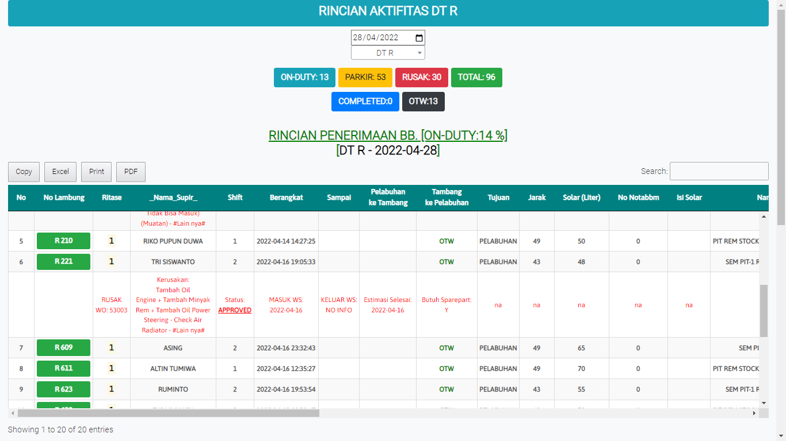
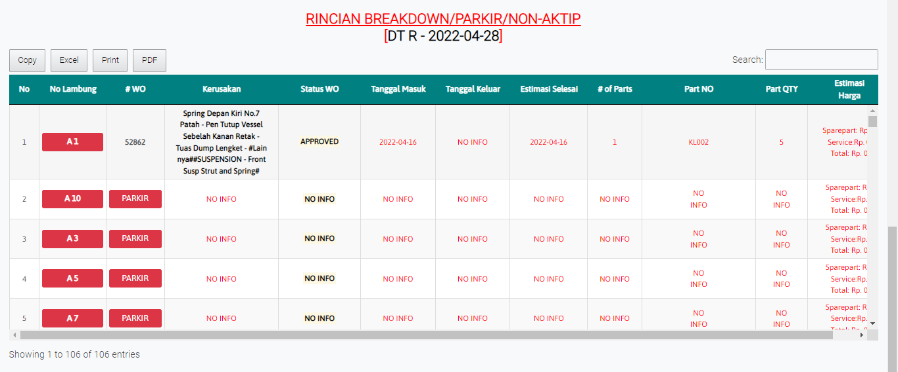
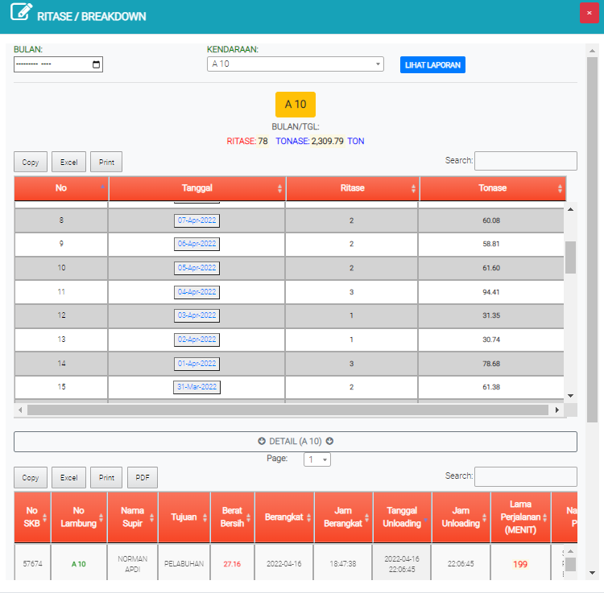

# Laporan Hauling Detail Kendaraan

### RINCIAN PENERIMAAN BB

Tabel ini menginformasikan rincian kendaraan untuk pengantaran batubara perbulannya. Masukan tanggal dan tipe kendaraan untuk mencari sesuai yang diperlukan

### RITASE BREAKDOWN/PARKIR/NON AKTIP

Tabel ini menginformasikan status kendaraan yang terjadi disetiap tipe kendaraan. Klik no.lambung untuk melihat informasi detail di setiap kendaraan.

### RITASE BREAKDOWN

Tampilan ini akan muncul ketika mengklik nomor lambung kendaraan. Laporan memperlihatkan informasi setiap kendaraan yang dipilih, user bisa mencari periode dan nomor lambung yang dicari
