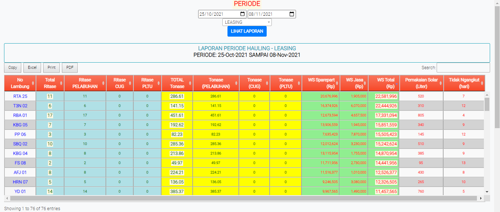
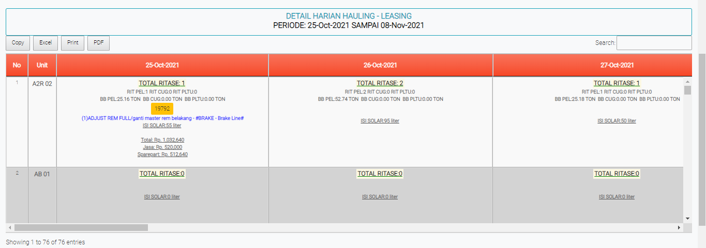
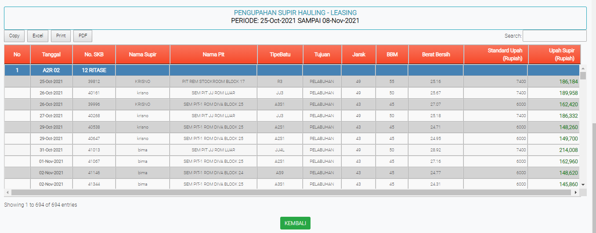

# Laporan Hauling Periode

### LAPORAN PERIODE HAULING

Tabel ini menginformasikan kendaraan yang melakukan pengiriman batubara. Bisa mengubah tanggal dan tipe kendaraan sesuai pilihan.

### DETAIL HARIAN HAULING

Tabel ini menginformasikan ritase bbm yang digunakan setiap kendaraan perharinya.

### PENGUPAHAN SUPIR HAULING

Tabel ini menginformasikan pengupahan setip supir yang mengantaran kan batubara perharinya. Disini juga memberikan detail pengantaran batubara disetiap tipe kendaraan
