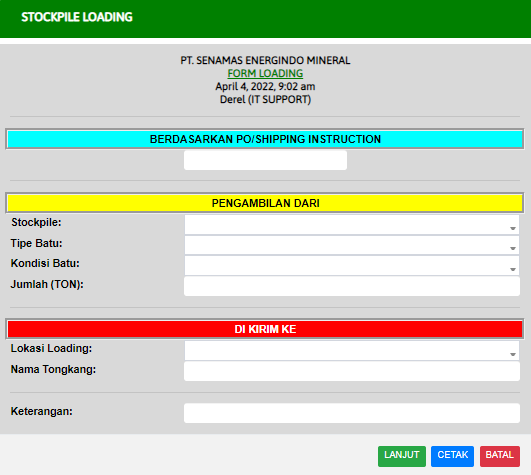

# Coal Loading

### STOCKPILE LOADING

Form ini digunakan untuk memberikan informasi muatan batubara

#### PENGAMBILAN DARI

* Stockpile : Lokasi penghancuran batubara (Masukan dengan list yang telah disediakan)
* Tipe Batu : Tipe batu yang didapatkan ditambang (Masukan dengan list yang telah disediakan)
* Kondisi Batu : Kondisi batubara (Masukan dengan list yang telah disediakan)
* Jumlah TON : Jumlah batubara untuk pengiriman (Masukan dengan list yang telah disediakan)

#### DI KIRIM KE

* Lokasi Loading : Lokasi untuk meletakan muatan batubara&#x20;
* Nama Tongkang : Nama Kapal yang digunakan untuk pengantaran
* Keterangan :smile::smile::smile::smile::smile::smile::smile::smile::smile::smile::smile::smile::thumbsup::thumbsup::thumbsup::thumbsup::thumbsup::thumbsup::thumbsup::thumbsup::thumbsup::thumbsup::thumbsup::thumbsup::thumbsup::thumbsup::thumbsup::thumbsup: Masukan keterangan pengantaran batubara
