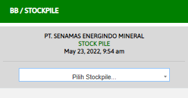

# Per Stockpile

### FORM PER STOCKPILE

Form ini digunakan untuk melihat informasi di setiap stockpile yang dimiliki rimau. Carilah stockpile sesuai dengan list yang telah di sediakan.

### SUMMARY STOCKPILE

.png>)

Hasil dari form tersebut akan keluar sepert ini, Tabel ini menginformasikan detail setiap stockpile di lokasi yang di tentukan
